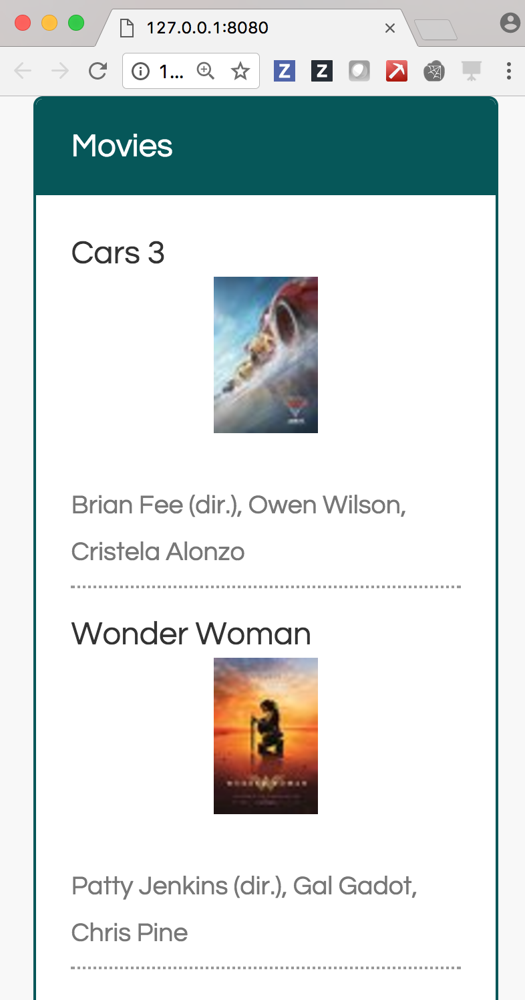

#TEMPLATE INCEPTION PROJECT
This is my attempt at using template to create a template that serves the web page using Jinja2 and Vue.js.
The detailed writeup of this work is on [my](mobileraj.github.io) blog [post]()

The screenshot shows the final web page generated using [IMDB](imdb.com) to scrape top movies of the week.

